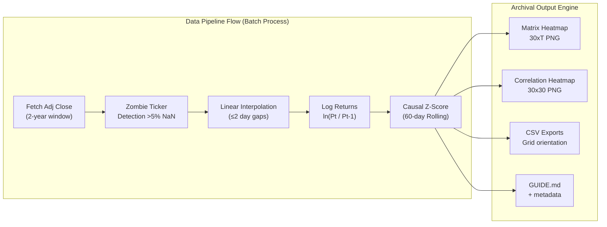
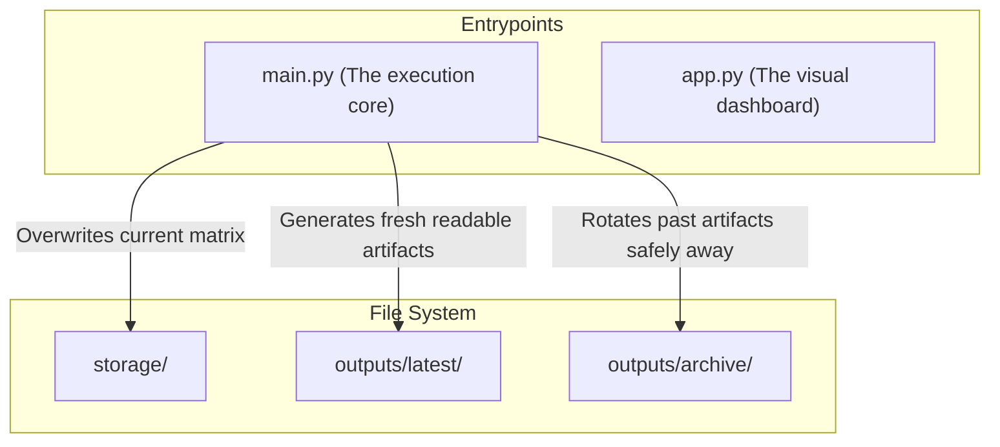

# Quant Matrix CLI

A highly structured, production-ready market data pipeline for **30 NASDAQ-100 US tech stocks**. It builds a Z-score standardized matrix with automatic correlation analysis, zombie ticker detection, and both batch and live WebSocket modes.

---

## ⚡ Quick Start 

The software has been heavily optimized so you don't need to learn a complex CLI or pass 10 different flags just to build your data. 

**Run these 3 steps:**

**1. Setup your environment (first time only)**
```bash
git clone https://github.com/sunsetnightshade/stat_cli.git
cd stat_cli

# Create a virtual environment
python -m venv .venv

# Activate it (Windows):
.venv\Scripts\activate
# OR Activate it (Linux/Mac):
source .venv/bin/activate

pip install -r requirements.txt
```

**2. Build the matrix (Fetches data, formats, standardizes, creates heatmaps)**
```bash
python main.py
```

**3. Open the visual dashboard**
```bash
python -m streamlit run app.py
```

That's it! If you ran `python main.py`, your fresh heatmaps and CSVs immediately appear in the **`outputs/latest/`** folder. 

---

## 🛠 Command Guide & Expected Outputs

### Command 1: The Core Pipeline Builder
Command: `py main.py`

**What it does:**
1. Connects to the data provider and fetches a 2-year history for all 30 US Tech stocks.
2. Runs a **Zombie Sweeper**: Identifies any ticker missing >5% of its data, throws it out, and dynamically replaces it with a healthy reserve ticker.
3. Aligns the data into a strict 30xT matrix, ignoring market holidays, then calculates the pure Log Return matrix.
4. Runs a **Causal 60-day Rolling Z-Score** to standardize the entire grid with zero look-ahead bias.
5. Emits heatmaps and machine-readable data files.
6. **Smart-Archives**: Identifies whatever was previously in your `outputs/latest/` folder and moves it to `outputs/archive/<timestamp>/` so you never mix up an old run with a new run.

**The Output Structure You Will See:**
When you run `py main.py`, you will see a highly structured, Unicode-safe readout in your terminal:
```text
=================================================================
|        QUANT MATRIX  --  NASDAQ-100 Tech (30 Stocks)          |
=================================================================

-----------------------------------------------------------------
  Building Quant Matrix
-----------------------------------------------------------------
  [INFO] Date range : 2024-04-09 -> 2026-04-09
  [INFO] Tickers    : 30 primary + 5 reserve
  [OK]   All 30 tickers healthy - no zombies detected

-----------------------------------------------------------------
  Outputs Saved
-----------------------------------------------------------------
  [OK]   Matrix heatmap        : outputs/latest/matrix_heatmap.png
  [OK]   Correlation heatmap   : outputs/latest/correlation_heatmap.png
  [OK]   Standardized CSV      : outputs/latest/standardized_matrix_30xT.csv
  [OK]   Usage guide           : outputs/latest/GUIDE.md
  [OK]   Current matrix pickle : storage/current_matrix.pkl
```

**Where the data goes (What the outputs mean):**
Inside `outputs/latest/` you will find:
- **`matrix_heatmap.png`**: Every row is a stock, every column is a day. Bright Red = overperforming standard deviation. Deep Blue = underperforming.
- **`correlation_heatmap.png`**: A 30x30 grid proving how correlated the US tech sector is. If you see deep blue squares, that stock broke correlation pattern.
- **`standardized_matrix_30xT.csv`**: The exact numerical Z-score standard grid you can import into Excel, R, or Python.
- **`GUIDE.md`**: An auto-generated English instruction manual placed inside the folder that explains the files to whichever analyst is reading the folder.

### Command 2: The Visual Dashboard
Command: `py -m streamlit run app.py`

**What it does:**
Bootstraps a local visual interface in your browser containing 4 tabs:
1. **Build Tab**: Run the pipeline directly from the browser instead of the command line. Allows you to set specific date ranges.
2. **Matrix Tab**: See the 30xT Matrix Heatmap visually rendered, and download the CSV.
3. **Correlation Tab**: Features an active slider where you can flag pairs below a certain threshold.
4. **PCA Tab**: Decompose returns into Beta (Systematic) and Alpha (Idiosyncratic) components using a strict causal sliding window EVD to prevent look-ahead bias.
5. **Archive Tab**: Visually explore past data runs! Select any historical timestamp and preview what the market looked like exactly on that run.

### Command 3: System Verification
Command: `py main.py --verify`

**What it does:**
Checks your local environment and outputs a checklist ensuring all critical files (Heatmaps, Parquet stores, Data Params) actually exist on disk and aren't corrupted.

---

## 🏗 System Architecture

### 1. Data Pipeline Flow



### 2. Folder Layout & Organization
The software leverages an organizational structure so raw logs never mix with artifacts.



---

## 📡 Live Ingestion Setup (Optional)

If you are using real-time WebSockets, Quant Matrix also supports streaming infrastructure. WebSockets snap ticks into 1-minute OHLCV bars hosted in Redis.

**Prerequisites:** Redis running on `127.0.0.1:6379` + Valid Twelve Data or Polygon Key.

```powershell
# Set your environment
set QM_ENABLE_LIVE_INGEST=1
set QM_LIVE_PROVIDER=twelvedata
set TWELVEDATA_API_KEY=your_twelvedata_key

# 1. Start the permanent ingestion loop
py main.py --ingest-live

# 2. Build an analytics snapshot
py main.py --snapshot-live

# 3. Persist memory bars to Parquet for backup
py main.py --persist-live-hourly
```

## 🧪 Running Tests
The suite has 45 passing tests covering memory stability, data math, configuration integrity, and timestamp logic.
```powershell
py -m unittest discover -s tests -p "test_*.py" -v
```
